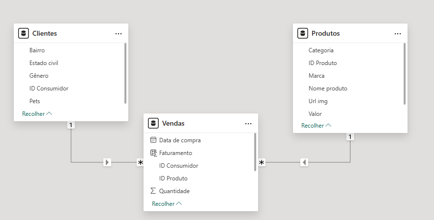
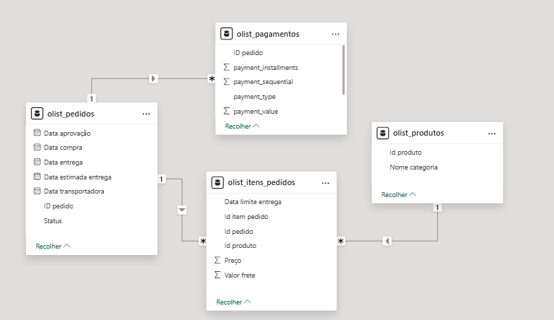
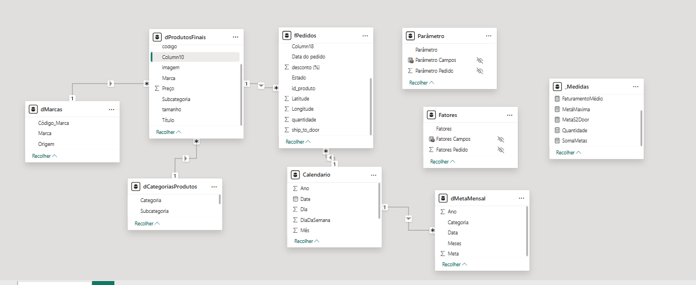

# Portfólio de Dashboards Power BI - Alura

Este repositório apresenta uma coleção de dashboards desenvolvidos durante a formação em Power BI da Alura, demonstrando minhas habilidades em análise de dados, modelagem, cálculos DAX e visualização.

## 📊 Dashboards Incluídos

- [Dashboard 1: Gatito Petshop](#dashboard-1-gatito-petshop)
- [Dashboard 2: E-commerce no Brasil](#dashboard-2-e-commerce-no-brasil)
- [Dashboard 3: Opuline](#dashboard-3-opuline)

---

## Dashboard 1: Gatito Petshop

### 📋 Visão Geral
Este dashboard foi desenvolvido para monitorar a saúde financeira e o comportamento de vendas do **Gatito Petshop**. Ele consolida dados de faturamento e vendas, permitindo uma análise rápida através de indicadores-chave (KPIs) e visuais interativos.

**Principais Insights e Funcionalidades:**
- **KPIs de Desempenho:** Acompanhamento em tempo real do faturamento total, média de pets por cliente e volume de vendas.
- **Análise Demográfica e Geográfica:** Distribuição do faturamento por gênero e ranking por bairro (destaque para Itaquera e Guaianases).
- **Sazonalidade:** Evolução do faturamento por ano, trimestre e mês, identificando tendências de mercado.
- **UX Interativa:** Utilização de *Image Grid* com ícones de produtos e barra de busca funcional para filtragem direta.

### 🖼️ Visualização
[📄 Clique aqui para visualizar o Dashboard](GatitoPetshop/Imagens/GatitoPetshop.png)

### 🏗️ Modelo de Dados
O projeto utiliza um **Esquema Estrela (Star Schema)**, garantindo máxima performance e organização:
- **Tabela Fato (`Vendas`):** Armazena os registros de transações, faturamento e quantidades.
- **Tabelas Dimensão (`Clientes` e `Produtos`):** Contêm os atributos necessários para os filtros e segmentações (Bairro, Gênero, Categoria, Marca).
- **Relacionamentos:** Conexões do tipo 1:N (um para muitos) com direção de filtro única das dimensões para a fato.



### 📏 Medidas DAX
Para extrair inteligência dos dados, foram criadas medidas personalizadas. Abaixo, destaco o cálculo do valor médio por produto:

**Valor Médio por Produto Vendido:**
```dax
Valor_medio_por_produto_vendido = SUM('Vendas'[Faturamento]) / SUM(Vendas[Quantidade])
```

### 🛠️ Tecnologias Utilizadas
- Power BI Desktop
- Power Query (M) para ETL
- DAX para cálculos de negócio
- Fonte de dados: Excel

---

## Dashboard 2: E-commerce no Brasil

### 📋 Visão Geral
Este dashboard foi desenvolvido para analisar o desempenho do **E-commerce no Brasil** no período de **01/2017 a 08/2018**. Ele consolida informações sobre volume de pedidos, formas de pagamento e distribuição de produtos por categoria, permitindo uma análise clara e objetiva do comportamento do comércio eletrônico no país.

**Principais Insights e Funcionalidades:**
- **KPIs de Desempenho:** Monitoramento do total de pedidos realizados no período, somando **99,28 mil pedidos**.
- **Análise Temporal:** Visualização da evolução mensal dos pedidos, evidenciando crescimento ao longo de 2017 e picos relevantes em 2018.
- **Preferência de Pagamento:** Predominância do **cartão de crédito (74%)**, seguido por boleto (19%), voucher (6%) e cartão de débito (2%).
- **Mix de Produtos:** Quantidade de produtos por categoria, com destaque para **Cama, Mesa e Banho**, **Beleza e Saúde** e **Informática e Acessórios**.
- **Interatividade:** Filtro por ano, permitindo análises dinâmicas conforme o período selecionado.

### 🖼️ Visualização
[📄 Clique aqui para visualizar o Dashboard](EcommerceNoBrasil/Imagens/EcommerceNoBrasil.png)

### 🏗️ Modelo de Dados
O projeto utiliza um **Esquema Estrela (Star Schema)**, garantindo performance e clareza analítica:
- **Tabela Fato (`olist_itens_pedidos`):** Armazena os itens vendidos, valores dos produtos e frete.
- **Tabelas Dimensão:**
  - **`olist_pedidos`**: Informações de datas, status e logística dos pedidos.
  - **`olist_pagamentos`**: Tipos de pagamento, parcelas e valores pagos.
  - **`olist_produtos`**: Categorias dos produtos.
- **Relacionamentos:** Estrutura 1:N, com correta propagação de filtros entre pedidos, pagamentos e produtos.



### 📏 Medidas DAX
Principais métricas de desempenho de marketing:

### 📏 Medidas DAX
Para análise percentual da preferência de pagamento, foi criada a seguinte medida:

**Percentual por Tipo de Pagamento:**
```dax
Medida =
DIVIDE(
    COUNT(olist_pagamentos[Tipo de pagamento]),
    CALCULATE(
        COUNT(olist_pagamentos[Tipo de pagamento]),
        ALL(olist_pagamentos)
    )
)
```

### 🛠️ Tecnologias Utilizadas
- Power BI Desktop
- DAX
- Conector Google Analytics

---

## Dashboard 3: Opuline

### 📋 Visão Geral
Este dashboard foi desenvolvido para acompanhar o desempenho comercial da **Opuline**, permitindo a análise detalhada de faturamento, metas, produtos vendidos e distribuição geográfica das vendas no período de **01/01/2021 a 31/12/2024**.

**Principais Insights e Funcionalidades:**
- **KPIs de Desempenho:** Faturamento total de **R$ 714 mil**, com **2.103 itens vendidos**.
- **Gestão de Metas:** Comparação entre faturamento realizado e metas definidas, com destaque visual para limites mínimo, esperado e máximo.
- **Análise Temporal:** Evolução da receita ao longo dos anos, identificando crescimento consistente entre 2022 e 2024.
- **Análise de Produtos:** Ranking de produtos mais vendidos e análise de quantidade por venda, segmentada por categoria (cabelos, maquiagem, perfumes e skincare).
- **Análise Geográfica:** Distribuição das vendas por localidade, com visualização em mapa.
- **Origem das Vendas:** Comparação entre vendas **nacionais** e **internacionais**.
- **Filtros Interativos:** Segmentação por categoria, subcategoria, origem e período.
  
### 🖼️ Visualização
[📄 Clique aqui para visualizar o Dashboard- Página 1](Opuline/Imagens/Opuline1.png)
[📄 Clique aqui para visualizar o Dashboard- Página 2](Opuline/Imagens/Opuline2.png)

### 🏗️ Modelo de Dados
O projeto utiliza um **Esquema Estrela (Star Schema)**, garantindo flexibilidade analítica e performance:
- **Tabela Fato (`fPedidos`):** Armazena os registros de vendas, quantidades, preços, descontos, localização e datas dos pedidos.
- **Tabelas Dimensão:**
  - **`dProdutosFinais`**: Informações dos produtos (preço, marca, categoria, subcategoria, tamanho e imagem).
  - **`dCategoriasProdutos`**: Estrutura hierárquica de categoria e subcategoria.
  - **`dMarcas`**: Dados das marcas e origem (nacional ou internacional).
  - **`Calendario`**: Dimensão de tempo com ano, mês, dia e dia da semana.
  - **`dMetaMensal`**: Metas definidas por período e categoria.
- **Tabelas Auxiliares:**
  - **Parâmetro** e **Fatores**: Utilizadas para controle dinâmico de métricas e análises.
- **Relacionamentos:** Conexões 1:N entre dimensões e a tabela fato, com propagação correta de filtros para análise multidimensional.


### 📏 Medidas DAX
Para suportar as análises de negócio, foram criadas medidas personalizadas em DAX. Abaixo, algumas das principais:

```dax
Faturamento =
SUMX(
    fPedidos,
    fPedidos[quantidade] * RELATED(dProdutosFinais[Preco])
)
FaturamentoMédio =
AVERAGEX(
    fPedidos,
    fPedidos[quantidade] * RELATED(dProdutosFinais[Preco])
)

SomaMetas =
AVERAGE(dMetaMensal[Meta])

MetaMaxima =
IF(
    [Faturamento] < [SomaMetas],
    [SomaMetas] * 1.2,
    [Faturamento]
)
```

### 🛠️ Tecnologias Utilizadas
- Power BI Desktop
- DAX
- Fonte de dados: Arquivos Excel (.xlsx)

---

Desenvolvido por [Lavinia Oliveira](https://www.linkedin.com/in/lav%C3%ADnia-oliveira-117993204/)
